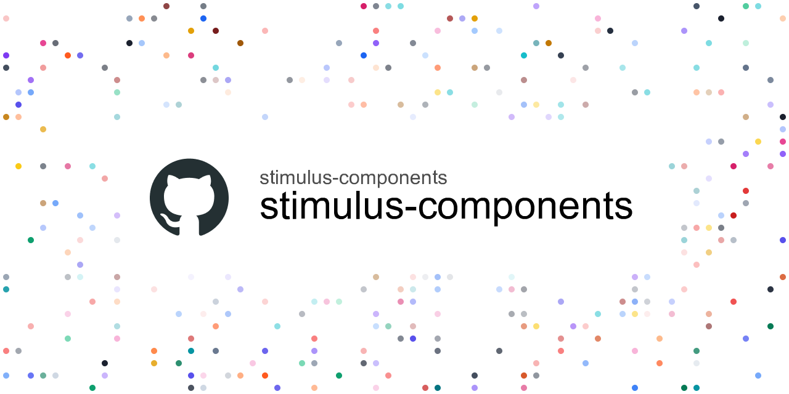

# Stimulus components

Configurable and customizable components for common JavaScript behavior with [Stimulus JS](https://stimulusjs.org/).
{: .fs-4 .grey-dk-000 }

## Introducing

I wrote a blog post to introduce this library.

👉 [Introducing Stimulus components](https://guillaumebriday.fr/introducing-stimulus-components)

## Support

You can support my work on [Patreon](https://www.patreon.com/guillaumebriday). 🙏

## Contributing

Do not hesitate to contribute to the controllers by adapting or adding features ! Bug reports or pull requests are welcome.

## License

This project is released under the [MIT](https://opensource.org/licenses/MIT) license.
